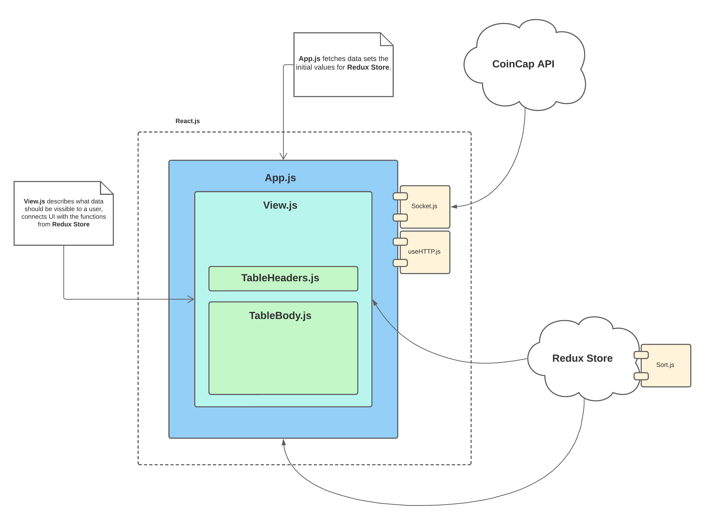

## Coin Tracker

The web application helps you to track the prices of 100 most popular coins.

## Docs
The web application is developed using `React.js` library.

I decided to use **Model-View-Controller pattern**
### Model
The simplified **Model** is `<CoinsProvider />` component, that is used to fetch data from [CoinCap API](https://docs.coincap.io/), and automatically update specific coins using `Websockets`

`<CoinsProvider />`  also contains all the functions to manipulate the data.  It is a top-level component, so it can provide bottom-level components with it.

### View
**View** is a `<TableBody/>` component.

It simply shows the data that was passed to him.

### Controller
The controller here is `<App />` component.

`<App />` connects the UI (**View**) to a **Model**,
it describes what data should be vissible in the **View** and
passes provides user with methods from `<CoinsProvider />` 

## About

This project I got after the interview in [Easycon Solution](https://www.easycon.cz/)